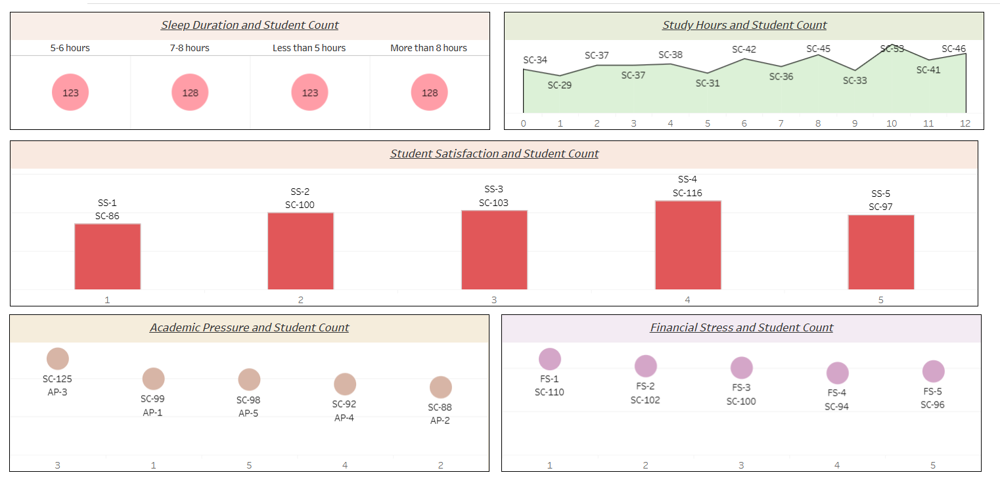

# Student Depression Analyzer

A Tableau Public dashboard that explores lifestyle and academic factors — sleep, study habits, satisfaction, and stress — across a student population, built to surface patterns that may relate to student mental health and wellbeing.



🔗 **Live Dashboard:** [Add your Tableau Public link here]

---

## 📊 About the Dashboard

This project visualizes survey/dataset responses from students, breaking the data down into five key views. Each panel is built to be read independently, so a viewer can quickly scan across sleep, study, satisfaction, and stress indicators without needing to cross-reference other charts.

### 1. Sleep Duration and Student Count
A four-category breakdown of how many students fall into each sleep duration bucket:
- Less than 5 hours
- 5–6 hours
- 7–8 hours
- More than 8 hours

Each category is displayed as a proportionally sized circle showing the student count, making it easy to compare group sizes at a glance.

### 2. Study Hours and Student Count
A line chart plotting student count against study hours (0–12 on the x-axis). The line moves up and down across the range, with each point on the chart labeled with its corresponding student count, showing how the number of students varies at each study-hour level.

### 3. Student Satisfaction and Student Count
A bar chart showing student count across five satisfaction levels (labeled 1 through 5). Each bar is labeled with an identifier (SS-1 through SS-5) and its associated student count, allowing quick comparison of how satisfaction is distributed across the student population.

### 4. Academic Pressure and Student Count
A bubble-style chart plotting student count against five academic pressure levels (1 through 5, ordered non-sequentially along the axis). Each bubble is sized and labeled with its student count and pressure-level identifier (AP-1 through AP-5), highlighting where academic pressure is most concentrated.

### 5. Financial Stress and Student Count
A bubble-style chart similar in format to the Academic Pressure view, plotting student count against five financial stress levels (1 through 5). Each bubble is labeled with its identifier (FS-1 through FS-5) and student count, showing how financial stress is distributed across the group.

---

## 🛠️ Tools & Technologies

- **Tableau Public** — dashboard design, data visualization, and publishing
- **Data source:** Student survey/dataset covering sleep, study habits, satisfaction, and stress indicators *(add your dataset name/source here)*

---

## 📁 Repository Contents

```
student-depression-analyzer/
├── README.md              # Project overview (this file)
├── dashboard.png           # Dashboard screenshot
└── [Tableau workbook / data files, if included]
```

> Note: If you're not including the raw `.twbx` file or dataset in this repo, consider adding a short note here on how to access them (e.g., link to the dataset source or a data privacy note).

---

## 🚀 How to View

1. Visit the [live Tableau Public dashboard](#) *(replace with your link)*.
2. Or clone this repository to view the screenshot and project documentation:
   ```bash
   git clone https://github.com/<your-username>/student-depression-analyzer.git
   ```

---

## 📌 Notes

- This dashboard is intended as an exploratory data visualization project and does not provide clinical or diagnostic conclusions about student mental health.
- All visualizations reflect counts and distributions present in the underlying dataset only.

---

## 📬 Contact

**[Your Name]**
[Your Email] · [LinkedIn] · [Portfolio Website]
